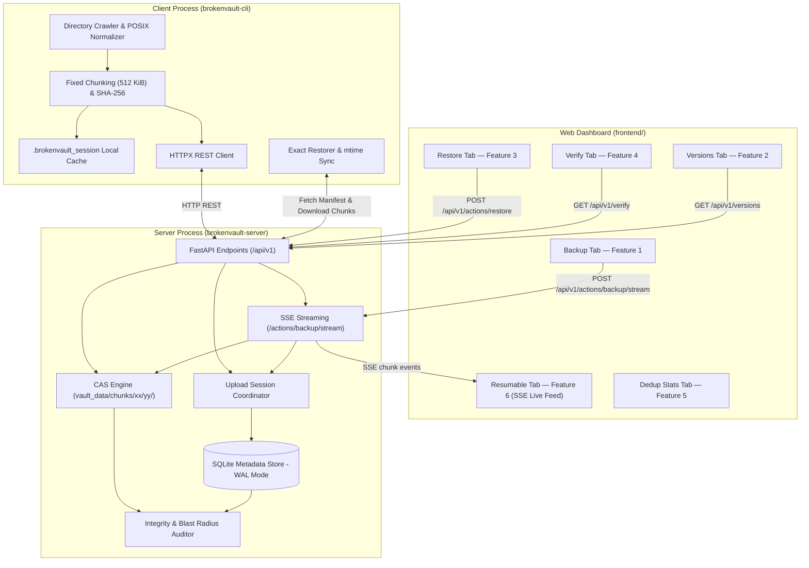
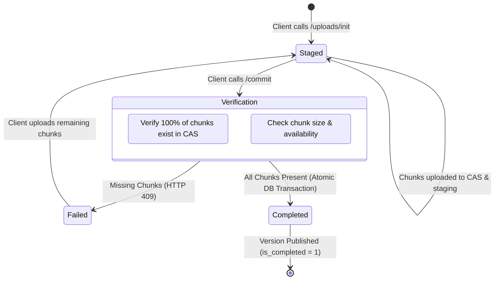
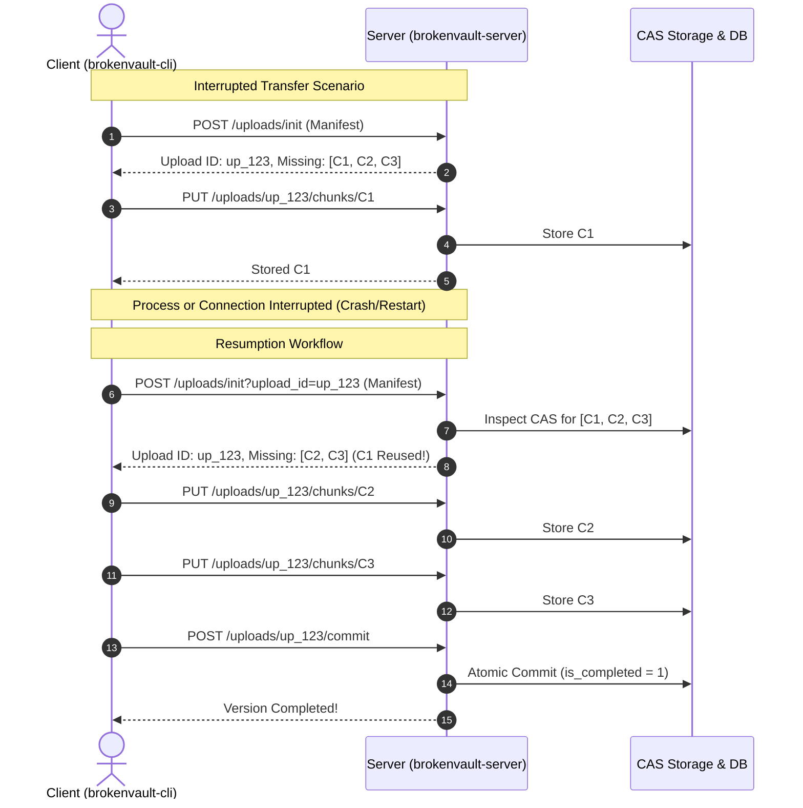

# Architecture Note

BrokenVault is a high-performance, deduplicating, content-addressed backup and recovery system designed for exact filesystem reconstruction, fault-tolerant network operations, and deterministic cryptographic auditability.

---

## Web Frontend (`frontend/`)

A premium, zero-dependency single-page application served directly by the FastAPI server at `http://127.0.0.1:8000/`. No separate dev server or build step is required.

### Structure
```
BitnBuild/
├── frontend/
│   ├── index.html   # SPA shell — sidebar, tabs, all panels
│   ├── style.css    # Dark-mode design system (CSS variables, animations, glassmorphism)
│   └── app.js       # All API communication and UI logic (Vanilla JS, no frameworks)
```

### How it is served
- FastAPI's `StaticFiles` mounts the `frontend/` directory at `/assets/`.
- The `GET /` route returns `frontend/index.html` via `FileResponse`.
- All API calls from the browser target the same origin (`/api/v1/*`), avoiding CORS complexity.

### Feature-to-tab mapping & dual-mode independence

The web dashboard and CLI are completely decoupled and independently functional:
- **Direct Frontend Actions**: The dashboard triggers backups via `POST /api/v1/actions/backup/stream` (SSE streaming) and restores via `POST /api/v1/actions/restore`, updating the live database and CAS without touching the terminal.
- **Independent CLI Execution**: The CLI client communicates over the exact same `/api/v1/*` protocol endpoints.

| Tab | Feature | Direct Execution Capability | CLI Equivalent |
|-----|---------|-----------------------------|----------------|
| **Dashboard** | Vault Overview | Live stat cards (versions, logical bytes, bytes saved, dedup ratio) + per-version storage bar chart | `list` / aggregate |
| **Backup** | Feature 1 | Enter folder path (or pick a preset), optional label, optional resume upload ID → click **Start Backup** | `brokenvault backup <PATH>` |
| **Versions** | Feature 2 | Sortable version table; Manifest Explorer; 1-click Restore action per row | `brokenvault list` |
| **Restore** | Feature 3 | Direct in-browser byte-for-byte reconstruction to a target folder with exact `mtime` restoration | `brokenvault restore <ID> <DEST>` |
| **Verify** | Feature 4 | Live SHA-256 cryptographic audit (`GET /api/v1/verify`) with blast-radius impact report | `brokenvault verify` |
| **Dedup Stats** | Feature 5 | Visual comparison bars of uploaded vs reused bytes across all versions | Aggregated from version list |
| **Resumable** | Feature 6 | On backup start → auto-redirected here; live chunk-by-chunk SSE progress feed, progress bar, dedup stats; resume interrupted sessions via upload ID | `brokenvault backup --upload-id <ID>` |

---

## Main parts

### Client Architecture (`brokenvault-cli`)
The client operates as an autonomous crawl and transfer agent responsible for filesystem indexing, content slicing, session negotiation, and byte-for-byte restoration:
- **Filesystem Traversal & Path Normalization**: Recursively walks the source directory tree. Converts platform-specific directory paths into safe, normalized POSIX-compliant relative paths (`/`). Enforces strict containment security by rejecting absolute paths (`/etc`, `C:\`), parent traversal attempts (`..`), and duplicate entries.
- **Inventory & Manifest Generation**: Catalogs regular files, nested directories, empty directories, and 0-byte files with exact modification timestamps (`mtime`) and logical byte lengths.
- **Deterministic Chunking Engine**: Streams file data through a zero-copy buffer, partitioning streams into deterministic fixed-size blocks (default 512 KiB). Computes lowercase hexadecimal SHA-256 cryptographic hashes for every chunk.
- **Delta Transfer Negotiator**: Initiates or resumes upload sessions with the server (`/api/v1/uploads/init`), submits candidate chunk digests to query missing parts (`/api/v1/uploads/{id}/missing-chunks`), and streams only uncommitted chunks over HTTP/1.1 REST.
- **Exact Restorer & Timestamp Synchronizer**: Rebuilds full directory trees from version manifests, downloads and validates chunk blobs, streams content into destination files, and synchronizes original modification times (`os.utime`).

### Server Architecture (`brokenvault-server`)
The server serves as an authoritative state coordinator, metadata indexer, and Content-Addressable Storage (CAS) vault:
- **FastAPI / ASGI Core**: High-concurrency asynchronous HTTP interface handling upload session lifecycles, chunk ingestion streams, version querying, chunk retrieval, and storage audits.
- **Upload Session Lifecycle Manager**: Tracks active upload states (`staged` vs `committed`) and provides idempotency guards across client or network interruptions.
- **Content-Addressable Storage (CAS) Subsystem**: Stores immutable chunk blobs keyed directly by their lowercase SHA-256 digest, organized in a 2-level fan-out directory structure (`vault/chunks/ab/cd/abcdef...blob`) to prevent filesystem inode degradation.
- **Relational Metadata Store**: Backed by SQLite in Write-Ahead Logging (WAL) mode with strict foreign key constraints, guaranteeing ACID transactional boundaries for version commits, file-to-chunk mappings, and version indexing.
- **Damage Auditor & Blast-Radius Engine**: Traverses active chunk dependencies across completed versions, compares live file digests against CAS addresses, and compiles granular impact assessments without altering damaged data.

### Physical Storage Layout
All persistent vault data resides within a configurable root directory (e.g., `./vault_data/`):
```text
vault_data/
├── metadata.db                  # SQLite database (versions, files, chunks, sessions)
├── metadata.db-wal              # Write-Ahead Log for concurrent read/write isolation
├── metadata.db-shm              # Shared memory index for WAL mode
├── staging/                     # Ephemeral directory for incoming chunk validation
│   └── temp_f83a91...           # In-flight chunk buffers before atomic rename
└── chunks/                      # Content-Addressable Storage (CAS) repository
    ├── 3b/
    │   └── 7a/
    │       └── 3b7a8d4...blob   # Raw, uncompressed, deduplicated chunk payload
    └── e3/
        └── b0/
            └── e3b0c44...blob
```



### SSE Streaming Backup (`POST /api/v1/actions/backup/stream`)

When a backup is triggered from the **Backup tab**, the browser receives a Server-Sent Events stream:

1. **`started`** — emitted once; carries `upload_id`, `version_id`, `total_files`, `total_chunks`, `total_bytes`, `new_chunks`, `reused_chunks`.
2. **`chunk`** — emitted once per chunk; carries `chunk_id`, `file`, `status` (`uploaded` | `reused`), `done_chunks`, `total_chunks`, `uploaded_bytes`, `total_bytes`.
3. **`done`** — emitted on successful commit; carries final `version_id`, `upload_id`, logical/uploaded/reused byte totals.
4. **`error`** — emitted if any step fails; carries `message`.

The frontend reads the stream with the Fetch API (`ReadableStream`) instead of `EventSource` because `EventSource` only supports GET requests. The Resumable tab renders each event in real time: animated progress bar, per-chunk feed rows colour-coded as **NEW** (purple) or **REUSED** (green), and a completion summary card.

---

## File list and chunks

### Recorded Version Information
When a version is saved, the metadata database and manifest capture comprehensive file system metadata:
- **Version Record (`versions` table)**:
  - `version_id`: Unique identifier (`v_<hex12>` or UUIDv4).
  - `source_label`: Base folder name or user-assigned identifier.
  - `created_at`: UTC ISO 8601 timestamp (`YYYY-MM-DDTHH:MM:SS.ffffff+00:00`).
  - `total_logical_bytes`: Cumulative uncompressed size of all files in the tree.
  - `uploaded_bytes`: Exact payload byte count of newly accepted chunks transferred during this session.
  - `reused_bytes`: Byte count of chunks that already existed in CAS and were deduplicated.
  - `is_completed`: Boolean flag (`1` for finalized and restorable, `0` for staged/incomplete).
- **Manifest Entry (`version_files` & `file_chunks` tables)**:
  - `path`: Safe relative POSIX path (e.g., `media/video.mp4` or `nested/empty_dir`).
  - `type`: Explicit item classification (`file` or `directory`).
  - `size_bytes`: Integer byte length (0 for empty files and directories).
  - `mtime`: Modification time in fractional Unix epoch seconds.
  - `chunk_ids`: Deterministic ordered array of SHA-256 strings (`["a1b2...", "c3d4..."]`). Empty files contain `[]`.

### File Splitting Mechanism
- Files are read sequentially in 512 KiB (524,288 bytes) blocks.
- Block slicing is strictly deterministic: the identical file content always yields identical chunk boundaries and chunk hashes regardless of system architecture or execution time.
- Empty files (0 bytes) produce 0 chunks and are tracked purely through metadata.
- Directories (including empty directories) produce 0 chunks and maintain directory presence and timestamps.

### Chunk ID Calculation
- Computed as the lowercase hexadecimal SHA-256 digest of the uncompressed chunk bytes:
  $$\text{Chunk ID} = \text{SHA256}(\text{Raw Chunk Bytes})$$
- The client computes this hash during local directory indexing.
- Upon receipt of a chunk, the server recalculates the SHA-256 digest over the raw incoming binary stream before storing it. If the computed hash does not match the URL route `chunk_id`, the chunk is rejected with an HTTP 400 Bad Request.

### Deduplication Engine
- **Pre-transfer Check**: The client queries `POST /api/v1/uploads/{upload_id}/missing-chunks` with all unique chunk IDs found in the source directory.
- **Server Index & CAS Lookup**: The server checks both its `chunks` SQLite table and physical disk CAS. Chunks already residing in CAS are filtered out and reported as reused.
- **Single-Instance Storage**: Chunks with identical content share the same file on disk (`vault/chunks/ab/cd/abcdef...blob`). Multiple files or versions referencing identical data simply insert relational foreign key pointers in `file_chunks` without duplicating binary data.

---

## Safe completion



### Representation of Unfinished Uploads
- Initiating an upload creates a record in `upload_sessions` with status `staged` and registers a draft entry in `versions` with `is_completed = 0`.
- Staged versions contain the full JSON manifest payload in `upload_sessions.manifest_json`, but their file-level relationships remain unindexed in `version_files` and `file_chunks`.

### Prevention of Incomplete Versions from Appearing
- **Query Isolation**: All user-facing version queries (`GET /api/v1/versions`) enforce `WHERE is_completed = 1`. Incomplete uploads remain invisible in version lists.
- **Restore Guard**: Manifest retrieval (`GET /api/v1/versions/{version_id}/manifest`) verifies `is_completed = 1`. Any attempt to restore an unfinished version returns HTTP 404/409.
- **Atomic Commit Transaction**: When the client calls `POST /api/v1/uploads/{upload_id}/commit`, the server verifies that every single chunk referenced across the entire manifest exists in CAS. If even one chunk is absent, the transaction aborts with HTTP 409 Conflict. Once verified, the version is committed in a single ACID database transaction, switching `is_completed = 1` atomically.

---

## Continue after a stop



### Unfinished Upload Identification
- The client stores active upload session metadata in a local hidden file `.brokenvault_session` within the source directory, recording `upload_id` and `version_id`.
- The CLI also accepts `--upload-id <ID>` to resume specific sessions manually.
- When resuming, the client passes `upload_id` to `/api/v1/uploads/init`. The server loads the existing staged session and binds to the same version ID.

### Discovering Missing Chunks
- The client sends the complete list of manifest chunk hashes to `POST /api/v1/uploads/{upload_id}/missing-chunks`.
- The server dynamically verifies chunk presence in CAS on disk, returning strictly the subset of chunk IDs that have not yet been stored.
- Already uploaded chunks are skipped, eliminating redundant network transfer.

### Request Idempotency
- **Repeated Chunk Uploads**: If a chunk upload request is re-sent, the server validates the hash, ensures CAS presence, and returns HTTP 200 without rewriting the file or duplicating entries.
- **Repeated Commit Requests**: If `/commit` is called on an already completed version, the server detects `is_completed == 1` and returns the existing completed version summary without error.

---

## Restore and verification

### File Reconstruction Pipeline
1. **Manifest Retrieval**: The restorer downloads the version manifest from `GET /api/v1/versions/{version_id}/manifest`.
2. **Directory Pre-allocation**: Directories are sorted by path depth and created first (`os.makedirs(exist_ok=True)`), ensuring empty directories and parent folders exist prior to file creation.
3. **Empty File Generation**: 0-byte files are created immediately without making network chunk requests.
4. **Sequential Chunk Assembly**: For regular files, chunks are fetched from `GET /api/v1/chunks/{chunk_id}` in the exact numerical index order specified by `chunk_ids` and streamed into the target file.
5. **Metadata & Timestamp Application**: After file contents are written and file handles closed, modification times are applied using `os.utime(target_path, (mtime, mtime))` in reverse hierarchical order (files first, parent directories last) to prevent directory write operations from overwriting restored directory timestamps.

### Hash Verification Points
- **Client Ingestion**: Client computes SHA-256 for each chunk sliced from source files.
- **Server Reception**: Server verifies `SHA-256(received_bytes) == chunk_id` before committing to CAS.
- **Client Restoration**: Client verifies `SHA-256(downloaded_chunk) == expected_chunk_id` before writing bytes to disk.
- **Vault Verification**: `verify` command recalculates SHA-256 digests for all chunks on disk.

### Damage Detection and Blast-Radius Analysis
The `verify` command audits all chunks referenced across all completed versions:
1. Gathers all unique `chunk_id` entries from `file_chunks` joined with `versions WHERE is_completed = 1`.
2. For each chunk, verifies physical file existence in CAS and recomputes the SHA-256 hash.
3. If a chunk file is missing or its hash differs from its filename, the system queries the relational metadata to determine the entire blast radius:
   $$\text{Affected Files} = \{(v.\text{version\_id}, fc.\text{path}) \mid fc.\text{chunk\_id} = \text{damaged\_id} \land v.\text{is\_completed} = 1\}$$
4. Compiles an impact report listing damaged chunk IDs, error status (`MISSING` or `CORRUPTED_HASH_MISMATCH`), affected version IDs, and every affected relative file path.
5. The system strictly reports findings and does not attempt automated data repairs or mutations.

---

## Important choices and limits

### Key Architectural Trade-offs
- **Fixed-Size Chunking (512 KiB) vs Content-Defined Chunking (CDC)**:
  - *Choice*: Fixed-size chunking provides exceptional scanning speed, minimal CPU overhead, deterministic chunk boundaries, and zero external dependency requirements.
  - *Trade-off*: Boundary shift occurs when bytes are inserted at the beginning of a file. For append and block-modification workloads (such as databases and sample datasets), fixed-size chunking achieves high deduplication ratios.
- **SQLite with WAL Mode vs Standalone Database Engine (PostgreSQL/MySQL)**:
  - *Choice*: Embedded SQLite with WAL mode requires zero external service configuration, provides ACID compliance, and handles concurrent client reads with transactional writes.
  - *Trade-off*: Vault metadata is bound to a single node, which aligns with the standalone client-server specification.
- **Atomic Renames (`os.replace`) for CAS Ingestion**:
  - *Choice*: Writing incoming streams to `staging/` and moving to `chunks/` via atomic file system rename guarantees that readers never observe partially written chunk files.

### Known Limitations
- **Single Active Backup Concurrency**: Designed for one active backup operation per vault at a time.
- **Excluded Filesystem Primitives**: In accordance with the project scope specification, symbolic links, hard links, named pipes, device nodes, extended attributes (xattrs), and OS-specific Access Control Lists (ACLs) are not captured.
- **Local Network Transport**: HTTP REST protocol is optimized for local loopback and LAN deployments without built-in TLS termination or authentication layers.
